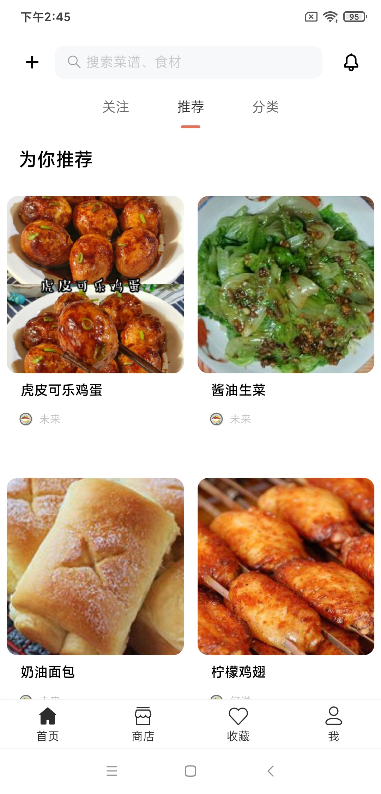
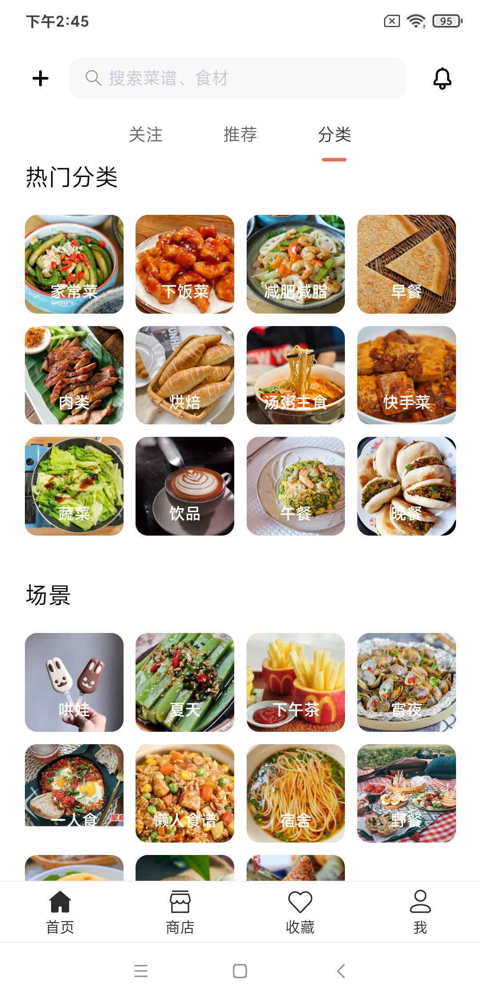
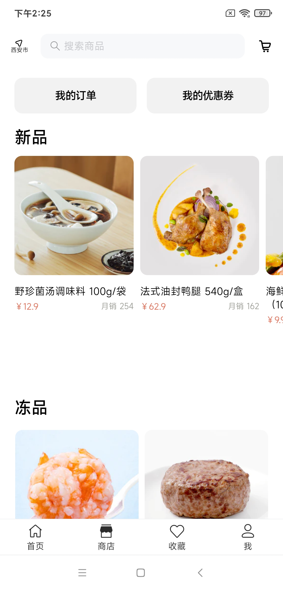
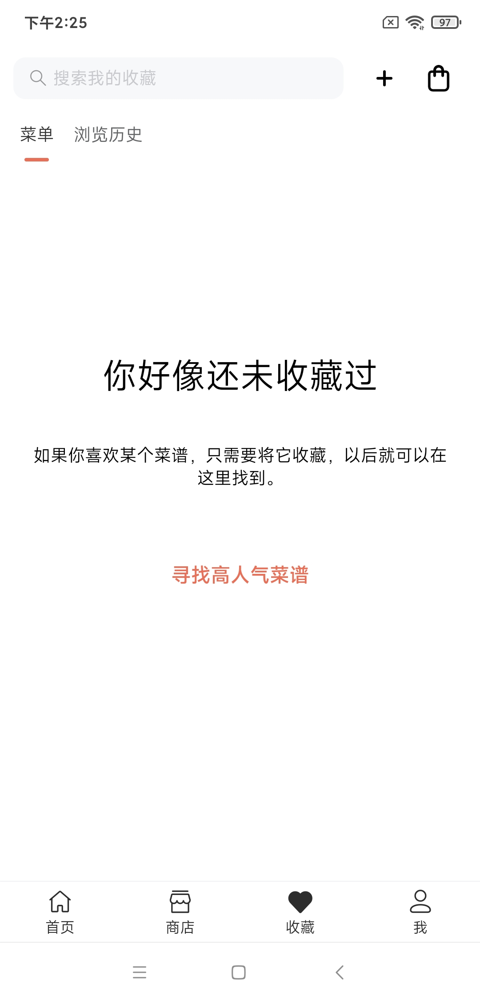
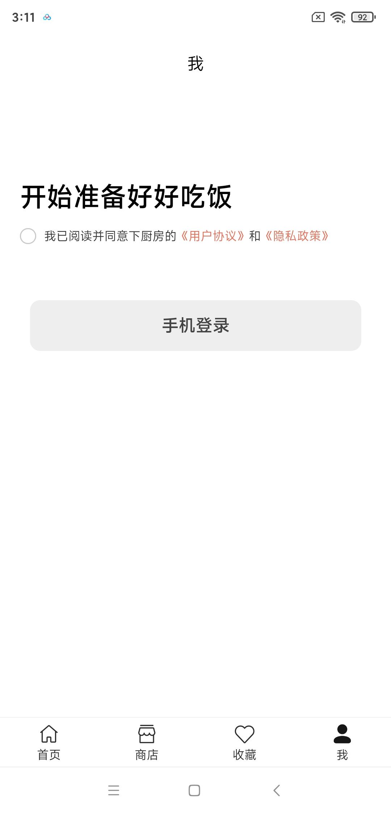
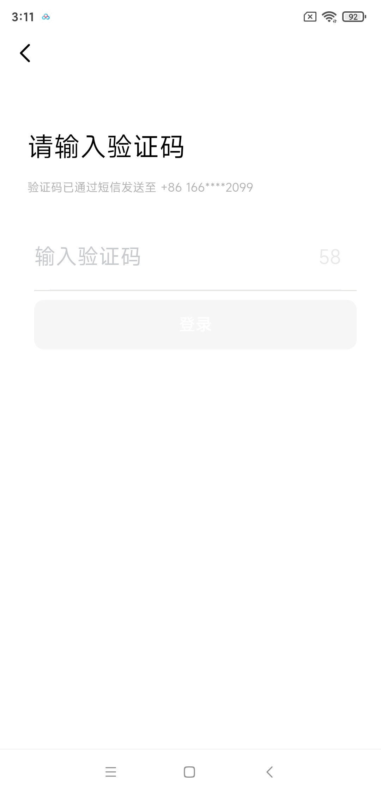
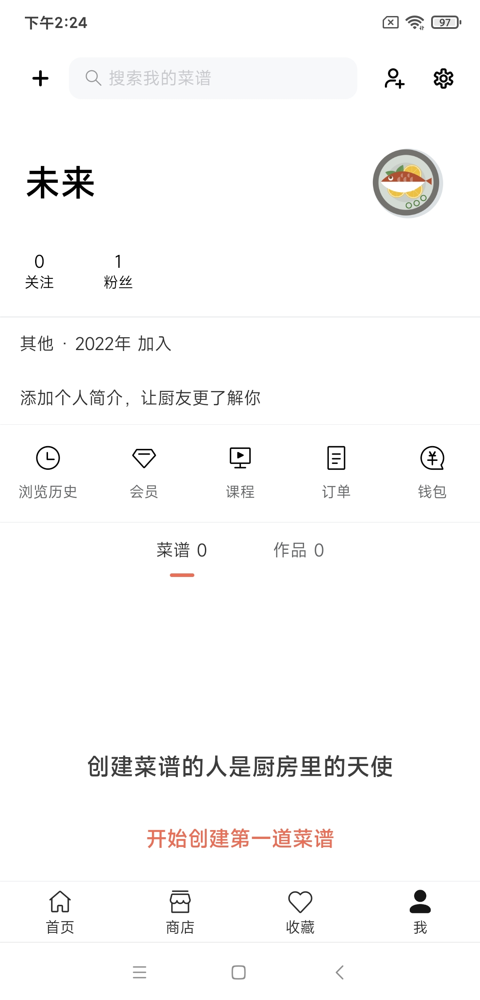

<div align="center">

# 仿下厨房APP


## 简介

此APP基于Vue3进行开发  
- 登录功能后台[Koa](./koa-app/README.md)  
- 系统后台[gokit](https://github.com/Cyan-kingfisher/gokit)

</div>

## 已装插件

- [Vant 3](https://vant-contrib.gitee.io/vant/#/zh-CN)
- [Sass](https://cn.vitejs.dev/guide/features.html#css-pre-processors)
- [Axios](https://cn.vitejs.dev/guide/features.html#css-pre-processors)
- [Vue router](https://next.router.vuejs.org/zh/index.html)
- [Pinia](https://pinia.vuejs.org/)
- [vite-plugin-svg-icons](https://github.com/anncwb/vite-plugin-svg-icons)
- [Mock](http://mockjs.com/)
- [gulp](https://gulpjs.com/)

## 目录结构

```
|─── koa-app                          # Koa后台
|─── public                           # 静态资源
|─── src                              # 源代码
|    │─── api                         # 所有请求
|    |─── assets                      # 图片、全局样式等静态资源
|    |─── components                  # 全局公用组件
|    |─── icons                       # 项目所有 svg icons
|    |─── mock                        # 项目mock 模拟数据
|    |─── router                      # 路由
|    |─── store                       # 全局 store管理
|    |─── utils                       # 全局公用方法
|    |─── vant-ui                     # 按需引入vant组件
|    |─── views                       # 所有页面
|    |─── App.vue                     # 入口页面
|    └─── main.js                     # 入口文件 加载组件 初始化等
|─── .env.development                 # 开发环境变量配置
|─── .env.production                  # 生产环境变量配置
|─── index.html                       # html模板
|─── package.json                     # package.json
|─── gulpfile.js                      # gulp配置文件
└─── vite.index.js                    # vite配置

```

## 全局样式

```
|─── scss   
|    │─── color.scss                 # 颜色
|    │─── vant.scss                  # vant样式覆盖
|    │─── global.scss                # 公共类
|    │─── index.scss                 # 入口文件
|    │─── transition.scss            # 动画相关
|    └─── variable.scss              # 变量
```

## icon-svg

1. 下载SVG文件 https://www.iconfont.cn/
2. 将SVG文件复制到src/icons/svg文件夹中
3. 重命名SVG文件格式为 icon- *
4. 组件模版中使用 &lt;icon-svg name="icon-*" color="#fff"&gt;&lt;/icon-svg&gt;

|  参数   |说明|类型|默认值|
|-------|:---:|:---:|:---:|
| name  |图标类名|string|—|
| color |图标颜色|string|—|

## 启动

```bash
# 克隆项目
git clone https://gitee.com/zhang-wenhaoyue/xiachufang

# 进入项目目录
cd xiachufang

# 安装依赖
npm install

# 启动服务
npm run dev
```

浏览器访问 <http://localhost:3000>  
开发环境使用 <b>.env.development</b> 配置文件  
生产环境使用 <b>.env.production</b> 配置文件

## 打包
```
|─── public   
|    │─── unpackage                  # 打包APP所需资源
|    │        │─── res               # 打包APP图片、开屏图片
|    │        └─── haoyue.keystore   # 打包APP自有证书 证书别名：haoyue  证书密码：123456           
|    │─── favicon.ico                # 网站图标
|    └─── manifest.json              # 打包APP配置文件
```
1. 运行npm run build打包项目，生成dist文件夹
2. 使用HBuilderX打开dist文件夹，选择发行-原生app云打包（仅支持安卓APP）
3. 在APP打包界面输入证书别名和密码，证书选择public文件夹-unpackage文件夹-haoyue.keystore。
4. 打包即可  
<i>注：</i>manifest.json为打包APP配置文件，相关配置请查看[文档](https://ask.dcloud.net.cn/docs/#//ask.dcloud.net.cn/article/94)

## 部署
1. 将目录下gulpfile.js中配置改为自己服务器配置
2. 打包项目后运行命令 <b>npm run up</b> 即可自动部署koa服务至服务器  
<i>注：</i>服务器需要安装node。首次部署请安装项目依赖。

## 文档
[HTML 5+ API规范](https://www.html5plus.org/doc/h5p.html)  
[Native.js入门指南](https://ask.dcloud.net.cn/docs/#//ask.dcloud.net.cn/article/88)

## 截图
<div style="text-align: center">








</div>
